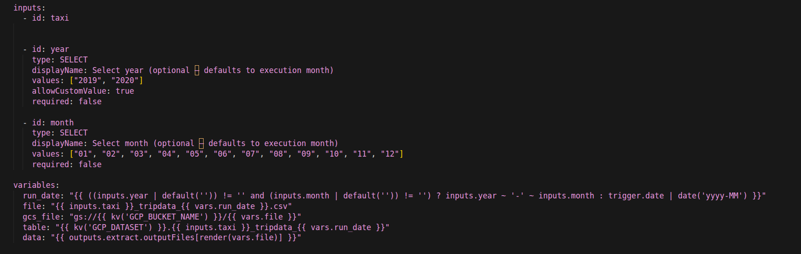
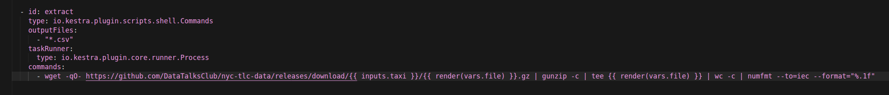
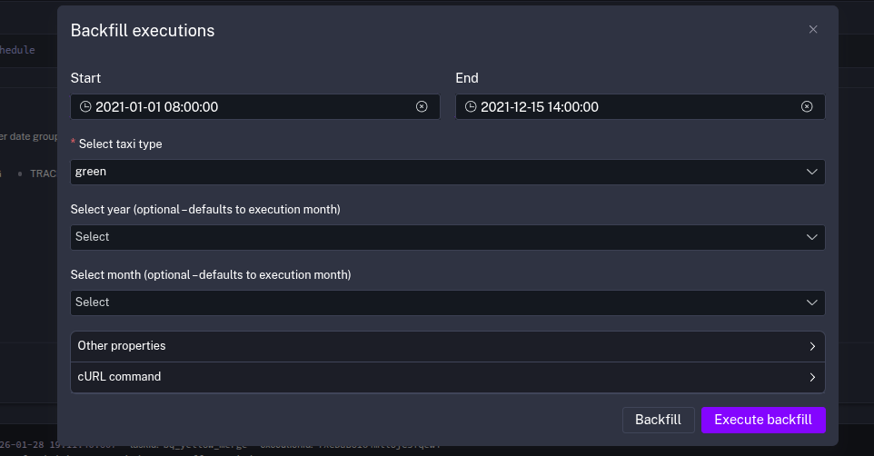
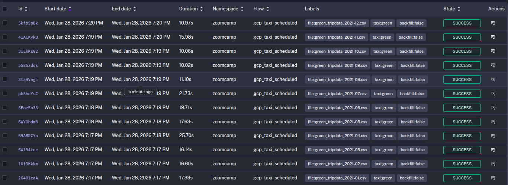
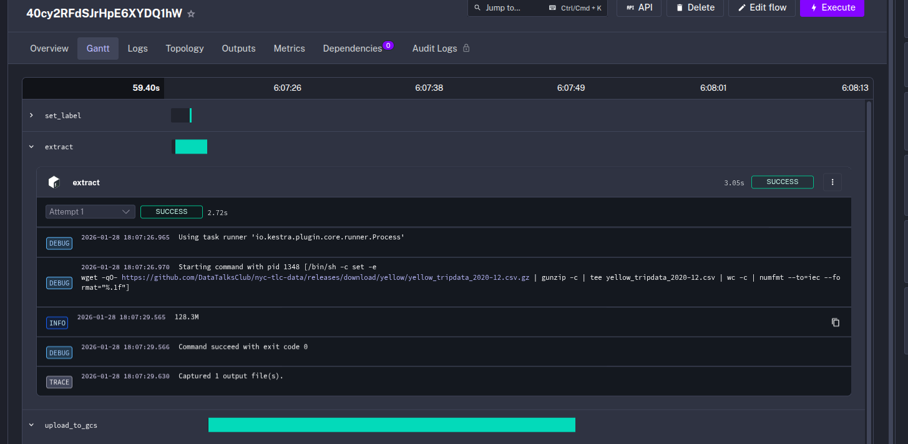
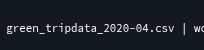
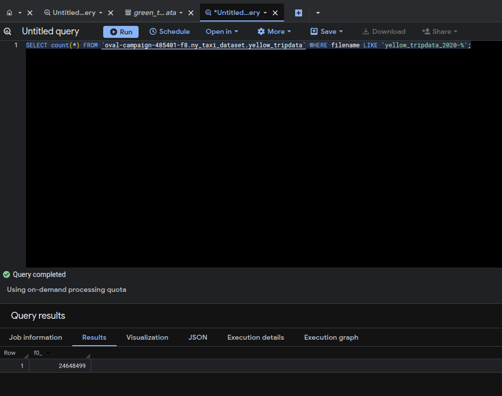
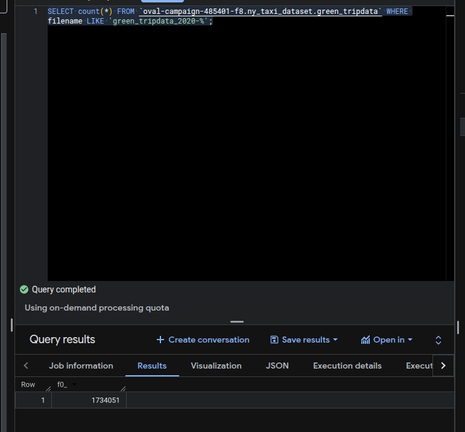
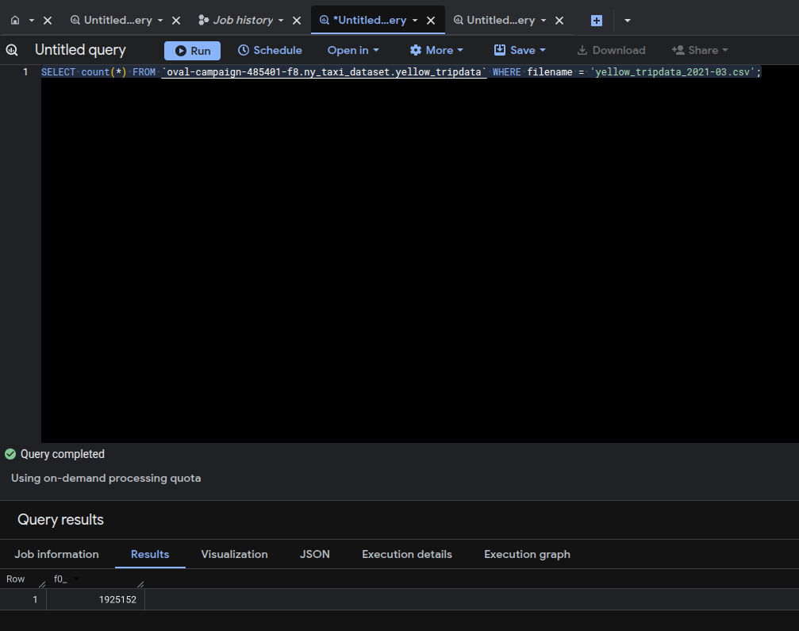

# Module 2: Workflow Orchestration with Kestra

This module covers setting up and using Kestra for workflow orchestration to process NYC taxi data (Yellow and Green) for years 2019, 2020, and 2021.

## Setup

### Docker Compose Configuration

The setup extends the Docker Compose configuration from Module 1 to include the Kestra server and its PostgreSQL database with appropriate volumes. 

**Note:** The ports have been changed from the official homework files. Kestra will be available at `localhost:8091` instead of the default port `8080`.

The complete Docker Compose configuration can be found at [`./docker-compose.yaml`](./docker-compose.yaml). It includes:

- PostgreSQL database for NYC taxi data (port 5444)
- pgAdmin interface (port 8090)
- Kestra PostgreSQL database for workflow metadata
- Kestra server (ports 8091 and 8092)

To start the services:

```bash
docker-compose up -d
```

## Step 1: Login to Kestra

1. Navigate to `http://localhost:8091` in your browser
2. Login using the credentials set in the Docker Compose file:
   - **Username:** `admin@kestra.io`
   - **Password:** `Admin1234!`

## Step 2: Setup Kestra KV Store

After logging in, add a flow for setting up the Kestra KV store with information about your GCP project, location, bucket name, and dataset name.

The workflow has been updated to take this information from the workflow inputs, making it more flexible and reusable. The flow is located at [`./flows/kv-setup.yaml`](./flows/kv-setup.yaml).

**Important:** Make sure you have executed the Terraform configuration from Module 1 to create the necessary resources in GCP (GCS bucket, and BigQuery dataset) before proceeding.

The KV setup flow will store the following values:
- `GCP_PROJECT_ID`: Your GCP project ID
- `GCP_LOCATION`: Your GCP location (e.g., US, europe-west2)
- `GCP_BUCKET_NAME`: Your GCS bucket name
- `GCP_DATASET`: Your BigQuery dataset name

Execute this flow with the appropriate inputs for your GCP setup.

## Step 3: Add GCP Service Account Credentials

After setting up the KV store with your GCP project information, add your GCP service account credentials to the Kestra KV store with the key `GCP_CREDS`.

You can do this by:
1. Going to the KV Store section in Kestra UI
2. Adding a new key-value pair with:
   - **Key:** `GCP_CREDS`
   - **Value:** The contents of your GCP service account JSON key file

Alternatively, you can use the Kestra API or add it programmatically through a flow.

## Step 4: Add ETL Flow

Add the ETL flow for processing Yellow and Green taxi data. The workflow is located at [`./flows/elt.yaml`](./flows/elt.yaml).

This workflow has been adapted to be utilized for both trigger backfill and manual execution. The key changes include:

### Variable Section Update

The variable section has been modified to support both scheduled triggers and manual/backfill executions. The `run_date` variable now checks if year and month inputs are provided, and if not, defaults to the execution date from the trigger.



### Extract Step Modification

The extract step has been modified to show the uncompressed file size of the output file as required for `Question 1`.



## Step 5: Backfill 2021 Data

Start the workflow backfill executions for Yellow and Green taxi data for the year 2021.

**Note:** The workflow triggers are scheduled for:
- **Green taxi data:** `1st` of each month at `9 AM`
- **Yellow taxi data:** `1st` of each month at `10 AM`

For the backfill, make sure to:
- **Green taxi:** Start from a time before 9 AM on January 1st and end after 10 AM on any date after December 1st
- **Yellow taxi:** Start from a time before 10 AM on January 1st and end after 10 AM on any date after December 1st





Above screenshots show the backfill configuration and execution for Green taxi data. The same process can be done for Yellow taxi data by updating the start and end dates accordingly (ensuring the start time is before 10 AM).

## Step 6: Backfill 2020 Data

Run the backfill for year 2020 data similar to Step 5 for both Yellow and Green taxi data. Use the same backfill functionality with appropriate date ranges covering the entire year 2020.

## Step 7: Query BigQuery

After the backfill executions complete, move to GCP BigQuery and run queries to answer the quiz questions. The data should now be available in your BigQuery dataset.

## Quiz Questions and Answers

### Question 1

**Within the execution for `Yellow` Taxi data for the year `2020` and month `12`: what is the uncompressed file size (i.e. the output file `yellow_tripdata_2020-12.csv` of the `extract` task)?**



**Answer:** `128.3 MiB`

---

### Question 2

**What is the rendered value of the variable `file` when the inputs `taxi` is set to `green`, `year` is set to `2020`, and `month` is set to `04` during execution?**



**Answer:** `green_tripdata_2020-04.csv`

---

### Question 3

**How many rows are there for the `Yellow` Taxi data for all CSV files in the year 2020?**



**Query:**
```sql
SELECT count(*) 
FROM `oval-campaign-485401-f8.ny_taxi_dataset.yellow_tripdata` 
WHERE filename LIKE 'yellow_tripdata_2020-%';
```

**Answer:** `24,648,499`

---

### Question 4

**How many rows are there for the `Green` Taxi data for all CSV files in the year 2020?**



**Query:**
```sql
SELECT count(*) 
FROM `oval-campaign-485401-f8.ny_taxi_dataset.green_tripdata` 
WHERE filename LIKE 'green_tripdata_2020-%';
```

**Answer:** `1,734,051`

---

### Question 5

**How many rows are there for the `Yellow` Taxi data for the March 2021 CSV file?**



**Query:**
```sql
SELECT count(*) 
FROM `oval-campaign-485401-f8.ny_taxi_dataset.yellow_tripdata` 
WHERE filename = 'yellow_tripdata_2021-03.csv';
```

**Answer:** `1,925,152`

---

### Question 6

**How would you configure the timezone to New York in a Schedule trigger?**

**Answer:** Add a `timezone` property set to `America/New_York` in the `Schedule` trigger configuration

---

## Summary

This module demonstrated:
- Setting up Kestra workflow orchestration
- Configuring KV store for GCP credentials and project information
- Creating ETL workflows for processing taxi data
- Using backfill functionality to process historical data
- Querying BigQuery to analyze processed data

The workflows are now set up to automatically process new taxi data on a monthly schedule, while also supporting manual execution and backfill operations for historical data processing.
