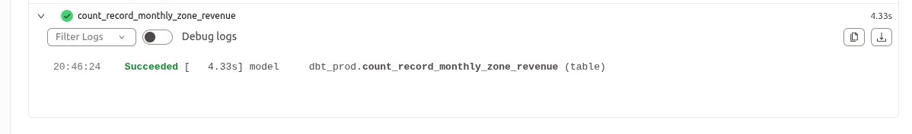
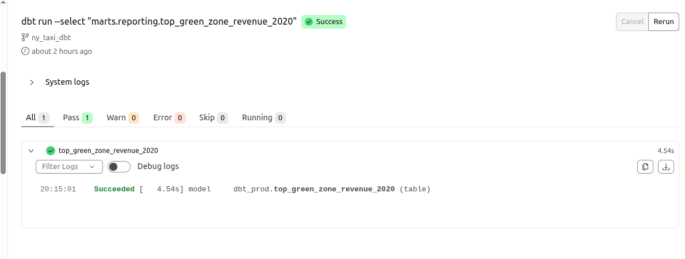
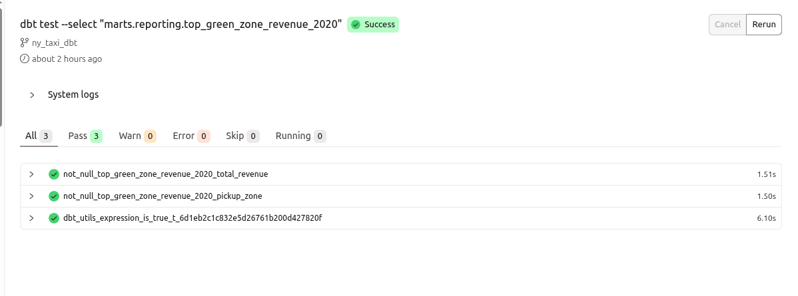
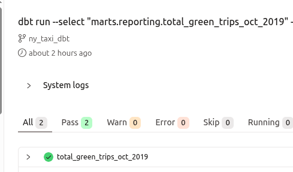
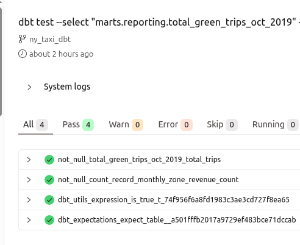

# Module 4: Analytics Engineering with dbt

This module covers analytics engineering using dbt (data build tool) to transform raw NYC taxi data into analytics-ready models. The project extends the dbt starter project to answer homework questions and demonstrates best practices for data transformation, testing, and lineage management.

## Project Overview

The dbt project is located in [`taxi_rides_ny/`](./taxi_rides_ny/) and follows a layered architecture:

- **Staging Layer** (`models/staging/`): Cleans and standardizes raw source data
- **Intermediate Layer** (`models/intermediate/`): Combines and prepares data for marts
- **Marts Layer** (`models/marts/`): Business-ready fact and dimension tables

## Setup

### Prerequisites

1. **dbt Cloud + BigQuery Setup**: This project was implemented using dbt Cloud with BigQuery as the data warehouse
2. **Source Configuration**: Update the raw sources in [`taxi_rides_ny/models/staging/sources.yml`](./taxi_rides_ny/models/staging/sources.yml) with your `<GCP_PROJECT_ID>` and `<BQ_DATASET_NAME>`
3. **Data Loading**: Ensure Green and Yellow taxi data for 2019-2020 is loaded into your warehouse

### Project Configuration

The dbt project configuration is defined in [`taxi_rides_ny/dbt_project.yml`](./taxi_rides_ny/dbt_project.yml):

- **Staging models**: Materialized as views
- **Intermediate models**: Materialized as tables
- **Marts models**: Materialized as tables

### Building the Project

This project was implemented using **dbt Cloud with a managed repository**. In dbt Cloud, you don't need to specify targets manually as dbt Cloud automatically runs commands on the linked environments configured in your project settings.

To build all models and run tests:

```bash
dbt build
```

Or to run models and tests separately:

```bash
dbt run
dbt test
```

> **Note:** In dbt Cloud, environments (dev, prod, etc.) are configured in the project settings and linked to specific BigQuery datasets. When you run commands in dbt Cloud, it automatically uses the environment's target configuration. For local dbt CLI usage, you would need to specify `--target prod` to build models in the production dataset.

After a successful build, you should have models like `fct_trips`, `dim_zones`, and `fct_monthly_zone_revenue` in your warehouse.

## Homework Questions and Solutions

### Question 1: dbt Lineage and Execution

**Question:** Given a dbt project with the following structure:
```
models/
├── staging/
│   ├── stg_green_tripdata.sql
│   └── stg_yellow_tripdata.sql
└── intermediate/
    └── int_trips_unioned.sql (depends on stg_green_tripdata & stg_yellow_tripdata)
```

If you run `dbt run --select int_trips_unioned`, what models will be built?

**Answer:** `int_trips_unioned` only

**Explanation:** 

When using `dbt run --select`, dbt only builds the selected model and its upstream dependencies by default. However, `dbt run --select` does **not** automatically include upstream dependencies unless explicitly specified with the `+` prefix (e.g., `dbt run --select +int_trips_unioned`).

To validate this, you can use:
```bash
dbt ls --select int_trips_unioned
```

This command shows which models would be selected without actually running them. The output confirms that only `int_trips_unioned` is selected.


**Reference:** The intermediate model [`int_trips_unioned.sql`](./taxi_rides_ny/models/intermediate/int_trips_unioned.sql) unions Green and Yellow taxi data but is not automatically built when selected without the `+` prefix.

---

### Question 2: dbt Tests

**Question:** You've configured a generic test like this in your `schema.yml`:

```yaml
columns:
  - name: payment_type
    data_tests:
      - accepted_values:
          arguments:
            values: [1, 2, 3, 4, 5]
            quote: false
```

Your model `fct_trips` has been running successfully for months. A new value `6` now appears in the source data. What happens when you run `dbt test --select fct_trips`?

**Answer:** `dbt will fail the test, returning a non-zero exit code`

**Explanation:**

dbt tests are executed independently of model runs. When you run `dbt test --select fct_trips`, dbt will:
1. Execute the `accepted_values` test on the `payment_type` column
2. Detect that value `6` exists in the data but is not in the accepted list `[1, 2, 3, 4, 5]`
3. Fail the test and return a non-zero exit code

**Important Note:** While `dbt run` will execute successfully (models build regardless of test failures), `dbt test` will fail. To make the entire ingestion process fail when tests fail, use `dbt build`, which runs both models and tests, stopping execution if any test fails.

---

### Question 3: Counting Records in `fct_monthly_zone_revenue`

**Question:** After running your dbt project, query the `fct_monthly_zone_revenue` model. What is the count of records in the `fct_monthly_zone_revenue` model?

**Answer:** `14,120`

**Solution:**

A reporting model was created at [`taxi_rides_ny/models/marts/reporting/count_record_monthly_zone_revenue.sql`](./taxi_rides_ny/models/marts/reporting/count_record_monthly_zone_revenue.sql) to answer this question:

```sql
select count(*) as count 
from {{ ref('fct_monthly_zone_revenue') }}
```

The model is defined in [`taxi_rides_ny/models/marts/reporting/schema.yml`](./taxi_rides_ny/models/marts/reporting/schema.yml) with appropriate documentation and tests.

To materialize and query:
```bash
dbt run --select "marts.reporting.count_record_monthly_zone_revenue"
```



**Reference:** The fact table [`fct_monthly_zone_revenue.sql`](./taxi_rides_ny/models/marts/reporting/fct_monthly_zone_revenue.sql) aggregates monthly revenue by pickup zone and service type.

---

### Question 4: Best Performing Zone for Green Taxis (2020)

**Question:** Using the `fct_monthly_zone_revenue` table, find the pickup zone with the **highest total revenue** (`revenue_monthly_total_amount`) for **Green** taxi trips in 2020. Which zone had the highest revenue?

**Answer:** `East Harlem North`

**Solution:**

A reporting model was created at [`taxi_rides_ny/models/marts/reporting/top_green_zone_revenue_2020.sql`](./taxi_rides_ny/models/marts/reporting/top_green_zone_revenue_2020.sql):

```sql
select 
    pickup_zone, 
    sum(revenue_monthly_total_amount) as total_revenue
from {{ ref('fct_monthly_zone_revenue') }}
where 
    service_type = 'Green' and 
    extract(year from revenue_month) = 2020
group by pickup_zone
qualify ROW_NUMBER() over (order by total_revenue desc) = 1
```

The model uses `QUALIFY` with `ROW_NUMBER()` to select the zone with the highest revenue. It's documented in [`taxi_rides_ny/models/marts/reporting/schema.yml`](./taxi_rides_ny/models/marts/reporting/schema.yml) with comprehensive tests:

- `dbt_utils.expression_is_true`: Ensures `total_revenue >= 0`
- `dbt_expectations.expect_table_row_count_to_equal`: Validates exactly one row is returned
- `not_null` tests on `pickup_zone` and `total_revenue`

To materialize and test:
```bash
dbt run --select "marts.reporting.top_green_zone_revenue_2020"
dbt test --select "marts.reporting.top_green_zone_revenue_2020"
```




---

### Question 5: Green Taxi Trip Counts (October 2019)

**Question:** Using the `fct_monthly_zone_revenue` table, what is the **total number of trips** (`total_monthly_trips`) for Green taxis in October 2019?

**Answer:** `384,624`

**Solution:**

A reporting model was created at [`taxi_rides_ny/models/marts/reporting/total_green_trips_oct_2019.sql`](./taxi_rides_ny/models/marts/reporting/total_green_trips_oct_2019.sql):

```sql
select 
    sum(total_monthly_trips) as total_trips
from {{ ref('fct_monthly_zone_revenue') }}
where 
    service_type = 'Green' and 
    extract(year from revenue_month) = 2019 and 
    extract(month from revenue_month) = 10
```

The model aggregates `total_monthly_trips` for Green taxis in October 2019. It's documented in [`taxi_rides_ny/models/marts/reporting/schema.yml`](./taxi_rides_ny/models/marts/reporting/schema.yml) with tests:

- `dbt_utils.expression_is_true`: Ensures `total_trips >= 0`
- `dbt_expectations.expect_table_row_count_to_equal`: Validates exactly one row is returned
- `not_null` test on `total_trips`

To materialize and test:
```bash
dbt run --select "marts.reporting.total_green_trips_oct_2019"
dbt test --select "marts.reporting.total_green_trips_oct_2019"
```




---

### Question 6: Build a Staging Model for FHV Data

**Question:** Create a staging model for the **For-Hire Vehicle (FHV)** trip data for 2019. After filtering out records where `dispatching_base_num IS NULL` and renaming fields to match your project's naming conventions, what is the count of records in `stg_fhv_tripdata`?

**Answer:** `43,244,693`

**Solution:**

#### Step 1: Data Ingestion

FHV trip data for 2019 was ingested using a Kestra workflow located at [`workflow/fhv_ingestion.yml`](./workflow/fhv_ingestion.yml). The workflow:

1. Downloads FHV trip data from the [NYC TLC data repository](https://github.com/DataTalksClub/nyc-tlc-data/releases/tag/fhv)
2. Uploads to Google Cloud Storage
3. Creates external tables in BigQuery
4. Loads data into partitioned BigQuery tables with deduplication using `MERGE` statements

The workflow supports both scheduled execution and backfill operations. For this homework, a backfill was executed for the year 2019.

#### Step 2: Staging Model

The staging model was created at [`taxi_rides_ny/models/staging/stg_fhv_tripdata.sql`](./taxi_rides_ny/models/staging/stg_fhv_tripdata.sql):

```sql
with source as (
    select * from {{ source('raw', 'fhv_tripdata') }}
),

renamed as (
    select
        -- identifiers
        cast(PULocationID as integer) as pickup_location_id,
        cast(DOLocationID as integer) as dropoff_location_id,

        -- timestamps
        cast(pickup_datetime as timestamp) as pickup_datetime,
        cast(dropOff_datetime as timestamp) as dropoff_datetime,

        -- trip info
        cast(dispatching_base_num as string) as dispatching_base_num,
        cast(Affiliated_base_number as integer) as affiliated_base_number,
        {{ safe_cast('SR_FLAG', 'integer') }} as sr_flag,

    from source
    -- Filter out records with null dispatching_base_num (data quality requirement)
    where dispatching_base_num is not null
)

select * from renamed
```

The model:
- References the raw source defined in [`taxi_rides_ny/models/staging/sources.yml`](./taxi_rides_ny/models/staging/sources.yml)
- Renames fields to match project naming conventions (e.g., `PULocationID` → `pickup_location_id`)
- Filters out records where `dispatching_base_num IS NULL`
- Uses the `safe_cast` macro for handling nullable integer fields

The source is configured in [`taxi_rides_ny/models/staging/sources.yml`](./taxi_rides_ny/models/staging/sources.yml) and the model is documented in [`taxi_rides_ny/models/staging/schema.yml`](./taxi_rides_ny/models/staging/schema.yml).

#### Step 3: Record Count

The count was determined by querying BigQuery directly:

```sql
SELECT
  COUNT(*)
FROM
  `<GCP_PROJECT_ID>.<BQ_DATASET_NAME>.fhv_tripdata` 
WHERE dispatching_base_num IS NOT NULL;
```

**Answer:** `43,244,693`

---

## Project Structure

```
Module 4/
├── taxi_rides_ny/              # dbt project
│   ├── models/
│   │   ├── staging/            # Staging layer (views)
│   │   │   ├── stg_green_tripdata.sql
│   │   │   ├── stg_yellow_tripdata.sql
│   │   │   ├── stg_fhv_tripdata.sql
│   │   │   ├── sources.yml
│   │   │   └── schema.yml
│   │   ├── intermediate/       # Intermediate layer (tables)
│   │   │   ├── int_trips_unioned.sql
│   │   │   ├── int_trips.sql
│   │   │   └── schema.yml
│   │   └── marts/              # Marts layer (tables)
│   │       ├── dim_vendors.sql
│   │       ├── dim_zones.sql
│   │       ├── fct_trips.sql
│   │       ├── reporting/
│   │       │   ├── fct_monthly_zone_revenue.sql
│   │       │   ├── count_record_monthly_zone_revenue.sql
│   │       │   ├── top_green_zone_revenue_2020.sql
│   │       │   ├── total_green_trips_oct_2019.sql
│   │       │   └── schema.yml
│   │       └── schema.yml
│   ├── macros/                 # Custom macros
│   ├── seeds/                  # Reference data
│   ├── dbt_project.yml         # Project configuration
│   └── packages.yml            # dbt package dependencies
├── workflow/
│   └── fhv_ingestion.yml       # Kestra workflow for FHV data
├── screenshots/                # Validation screenshots
├── guide.md                    # Implementation notes
├── hw_markdown.md             # Original homework questions
└── README.md                   # This file
```

## Key Concepts Demonstrated

### 1. dbt Lineage and Dependencies
- Understanding how `dbt run --select` works with model dependencies
- Using `dbt ls` to inspect model selection

### 2. Data Testing
- Generic tests (`accepted_values`, `not_null`)
- Custom tests using dbt packages (`dbt_utils`, `dbt_expectations`)
- Test execution and failure handling

### 3. Layered Architecture
- **Staging**: Clean and standardize raw data
- **Intermediate**: Combine and prepare data
- **Marts**: Business-ready analytics tables

### 4. Data Quality
- Filtering invalid records (NULL checks)
- Standardizing column names and data types
- Comprehensive testing strategy

### 5. Integration with Orchestration
- Using Kestra workflows (from Module 2) for data ingestion
- Combining ELT (Extract, Load, Transform) with dbt transformations

## Dependencies

The project uses the following dbt packages (defined in [`taxi_rides_ny/packages.yml`](./taxi_rides_ny/packages.yml)):

- `dbt-labs/dbt_utils`: Utility macros and tests
- `metaplane/dbt_expectations`: Advanced data quality tests
- `dbt-labs/codegen`: Code generation utilities

Install packages with:
```bash
dbt deps
```

## Summary

This module demonstrated:

✅ Building transformation models with dbt  
✅ Creating staging, intermediate, and fact tables  
✅ Writing tests to ensure data quality  
✅ Understanding lineage and model dependencies  
✅ Analyzing revenue patterns across NYC zones  
✅ Integrating dbt with workflow orchestration (Kestra)  
✅ Implementing best practices for analytics engineering  

The project transforms raw taxi data into analytics-ready models, enabling business users to analyze revenue patterns, trip counts, and zone performance across different service types and time periods.

---

## References

- [dbt Documentation](https://docs.getdbt.com/)
- [dbt Community](https://getdbt.com/community)
- [Original Homework Questions](./hw_markdown.md)
- [Implementation Guide](./guide.md)

